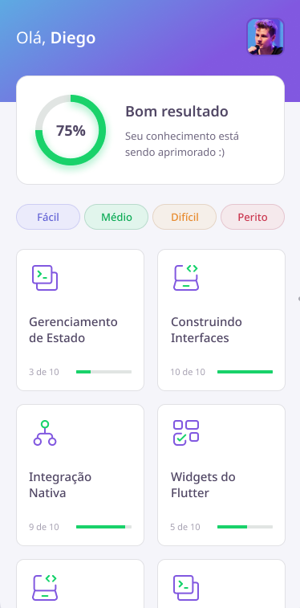

## :rocket: Flutter DevQuiz

    
  
 

O DevQuiz é uma aplicação desenvolvida na [Next Level Week 05](https://nextlevelweek.com/), semana realizada pela [Rocketseat](https://rocketseat.com.br/) na trilha de Flutter.

  

A prototipação completa do projeto pode ser visualizada no Figma [clique aqui](https://www.figma.com/file/fMqKhwT9L5D3MVe4btRtG5/DevQuiz?node-id=0%3A1)

# :computer: Libs utilizadas

## Flutter

- [GoogleFonts](https://pub.dev/packages/google_fonts)
- [SharePlus](https://pub.dev/packages/share_plus)
